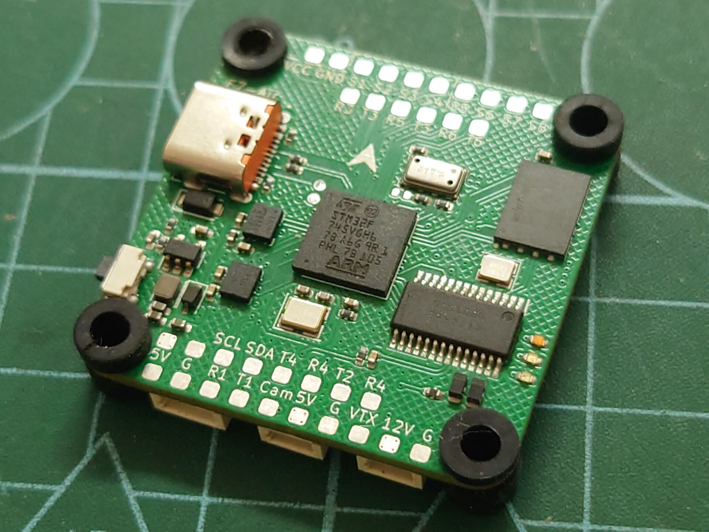
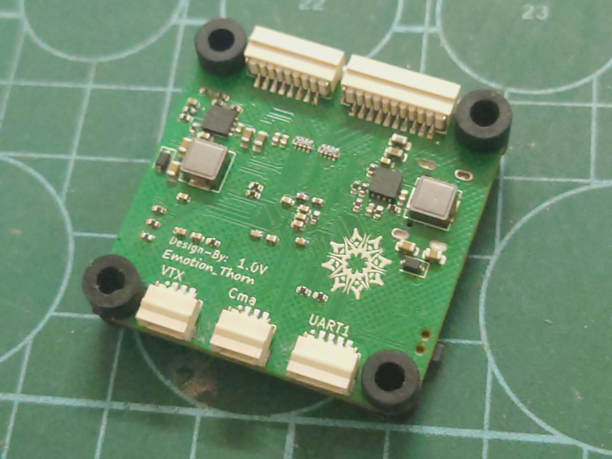

<<<<<<< HEAD
# NewSky📺
          
* [**中文版本**](/README_zh.md)

## Overview📖

=======
<h1 align="center">NewSky</h1>

           
* [**中文版本**](/README_zh.md)

## Overview📖
**Let beginners start making their own aircraft from scratch✈️** 
Projects that you can personally create:flight control ，racks (At present, we are not considering the production of ESC (the cost is too high))

**Supports multiple firmware options💿** 
NewSky Currently possessingPX4 Betaflight Inav Ardupolit firmware 

**Having different flight control models⚙️** 
NewSky use STM32 series as the main controller

## ⚠️⚠️⚠️ Commercial use without permission is strictly prohibited❗❗❗

### 📊Project Status 

|Complete|Making|Not started|
|-|-|-|
|✔|🛠️|❌|

## ⚙️Hardware 
### Flight controller
- ***NewSkyF7-Air*** ✔ 

|Top|Bottom|
|:--:|:--:|
|||

- STM32F745VG(Cortex-M7)
- Have three BEC (Max input 36V)
    - 12V 3A
    - 5V 3A 
    - 3V3 2A
- Have two IMU
    - BMI270
    - IMC4288P
- On-board barometer(MS5611)
- On-board FLASH(W25Q256/W25N01G)
- On-board OSD(AT7456)
> In addition to the provided pad, which can be soldered, the board can use JST-SH

>Due to the lack of DMA channels in S5 S6, it seems that X8 mode (8 motors) cannot be activated on Betaflight at present

> The PCB engineering files have been open-source

- ***H7-Pro*** 🛠️

## ....

## 💿Firmware 
- Betaflight
    - NewSkyF7-Air (4.4.4-Beta)
- Ardupolit🛠️
- Inav🛠️
- PX4🛠️

## 🌐Wireless connection ground station ğŸ› ï¸ 
>>>>>>> c5ff180fc82f0e98c3e5e9217bb21fad2d1e034f
