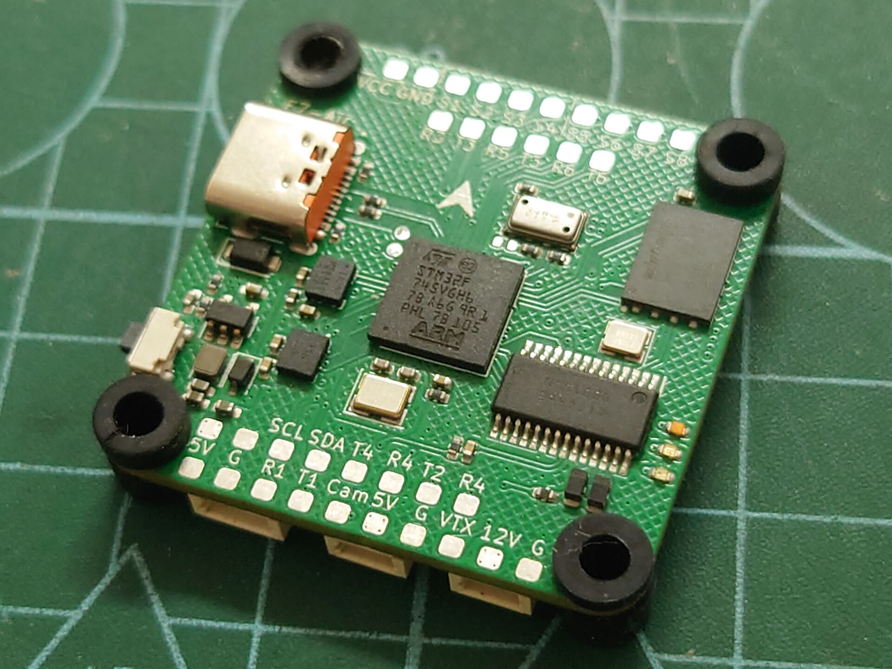
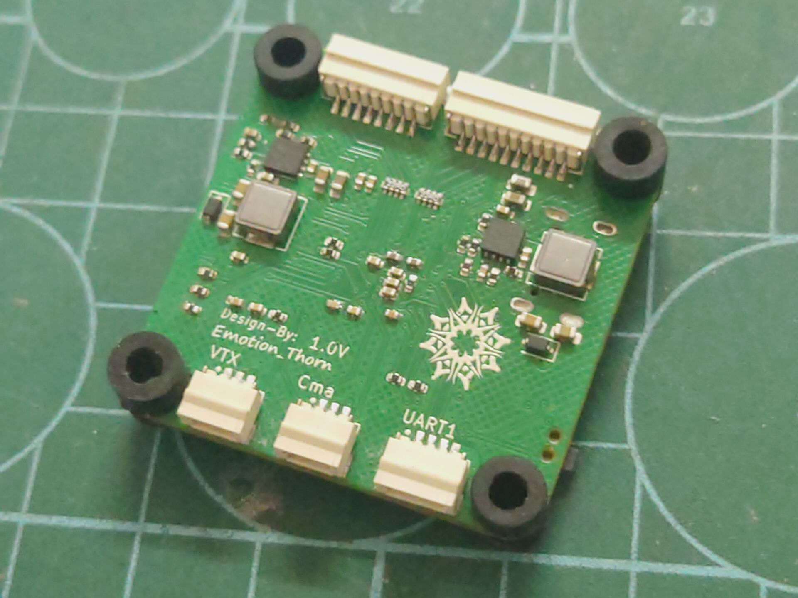

<h1 align="center">NewSky</h1>

   
* [**English version**](/README.md)

## 📖概述 
**让初学者从0开始制作属于自己的飞行器✈️** 
可制作项目有：飞控 机架.... (目前阶段不考虑制作电调(成本过高))

**支持多种固件💿** 
NewSky 目前支持PX4 Betaflight Inav Ardupolit的固件

**多种飞控型号⚙️** 
NewSky使用了市面上主流的STM32系列作为主控

## ⚠️⚠️⚠️ 未经许可严禁商业使用❗❗❗

### 📊项目进度 

|完成|进行中|未开始|
|-|-|-|
|✔|🛠️|❌|

## ⚙️硬件  
### 飞控
- ***NewSkyF7-Air*** ✔ 

|Top|Bottom|
|:--:|:--:|
|||

- STM32F745VG(Cortex-M7)
- 三路BEC (最大36V输入)
    - 12V 3A
    - 5V 3A 
    - 3V3 2A
- 双IMU
    - BMI270
    - IMC4288P
- 板载气压计(MS5611)
- 板载FLASH(W25Q256/W25N01G)
- 板载OSD(AT7456)
> 板子上除了提供的含盘可以焊接，也可以使用排插进行快捷替换

>由于S5 S6 无DMA通道，所以目前好像无法在Betaflight开启X8模式(8电机)

> 有关PCB工程文件已开源

- ***H7-Pro*** 🛠️

## ....

## 💿固件 
- Betaflight
    - NewSkyF7-Air (4.4.4-Beta)
- Ardupolit🛠️
- Inav🛠️
- PX4🛠️

## 🌐无线调参🛠️ 
